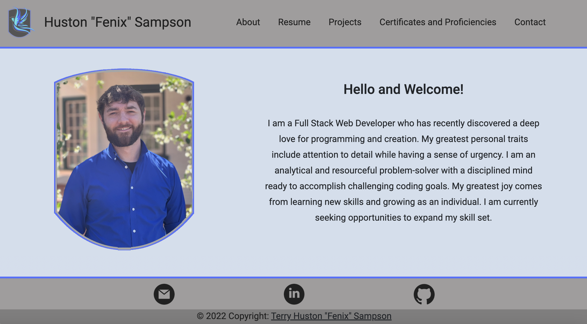
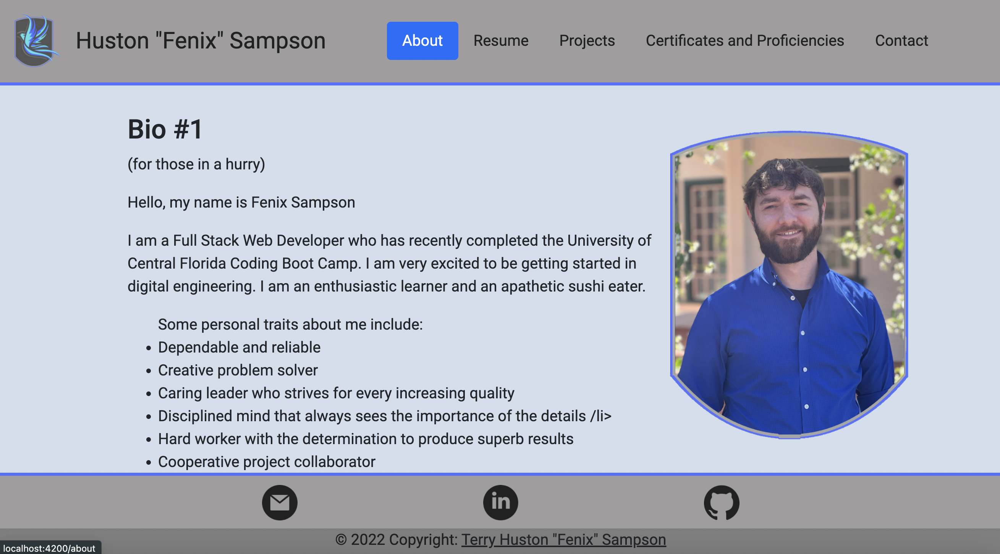
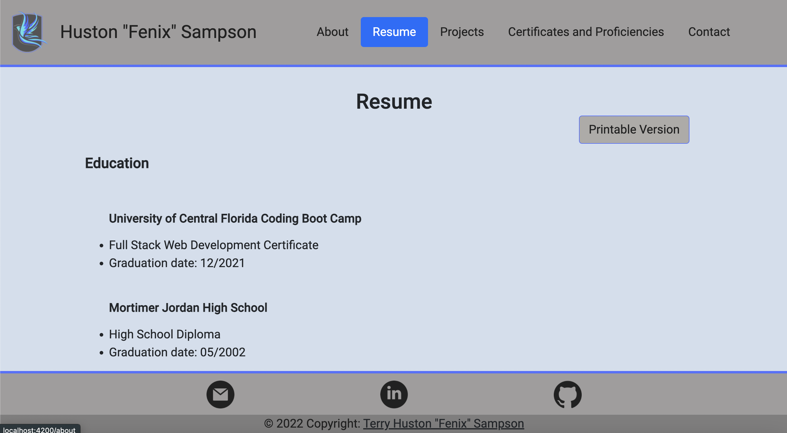
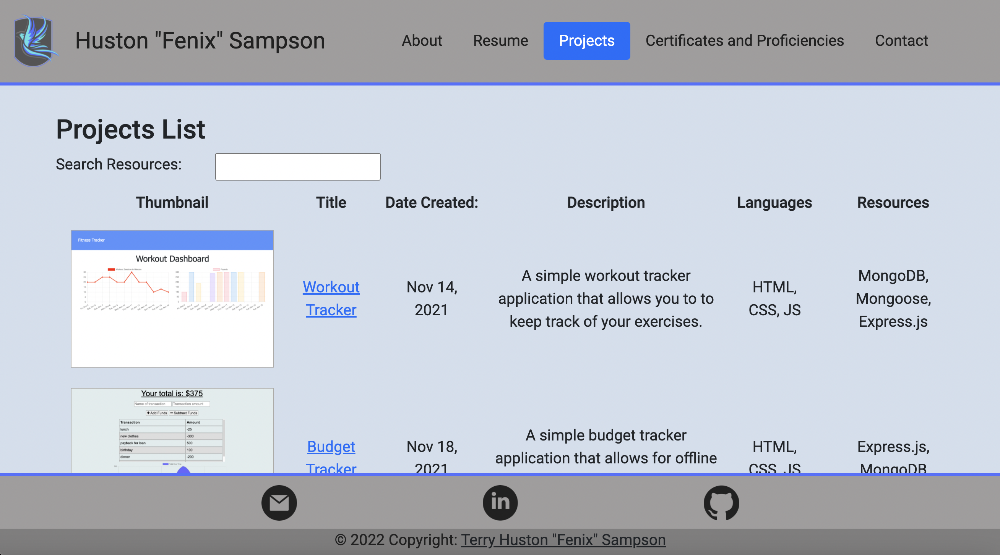
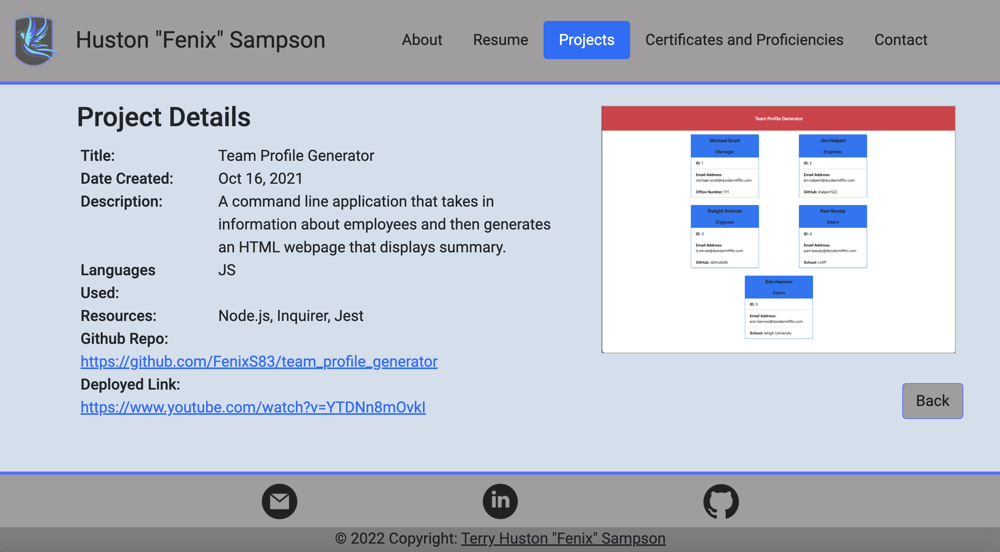
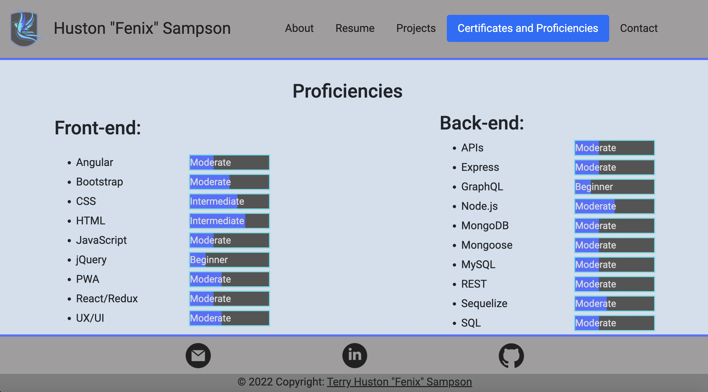

# Fenix Sampson Personal Portfolio

  

  ## Description

  I used Angular to build a new personal portfolio
  
 Deployed Link: [HERE](https://huston-fenix-sampson.herokuapp.com/)

  <!-- [URL](undefined) -->

  ## Table of Contents
  
  * [Goals](#goals)

  * [Usage](#usage) 

  * [Installation](#installation)  

  * [Test](#test)

  * [Problems](#problems)

  * [Screenshots](#screenshots)

  * [Contributions](#contributions)

  * [Resources](#resources)

  * [Contact](#contact) 

  * [License](#license) 

  
  ## Goals

  My goal in building this project was to improve upon my original portfolio design which was built using React.

  ## Motivation

  Every programmer and developer needs a professional portfolio that they can use to advertise themself and their skills.  My last portfolio was sufficient but I wanted to build a new one and use a new technology to build it with.  I chose to learn Angular so not only have I ended up with a new resume but I've also ended up with an additional skill to be able to add to my resume. 

  ## Usage

  I intend to use this as my primary portfolio for the time being.  I plan to continue adding, improving and redesigning it as my knowledge and skills improve over time.

  ## Installation
  
  npm -i  

  ## Test

  ng test

  ## Problems

  The primary problems I faced came primarily from being new to the framework.  I did have a few issues getting the json server routes to show and display correctly but now additional items can be added directly to the json file without needing to hardcode it in or mess with styling. 

  ## Screenshots

This is the Welcome component that should load first upon page landing.

This is the About page that has more detailed personal information about me.

The Resume page has my education and extended work history as well as the button for the printable version of my resume.

On the Projects List page you can find the summarized information about all the projects that I have completed so far. 

Once clicking on the individual project, the Project Details load which shows greater details and deployed links for each project.

I organized my Certificates and Proficiencies onto a single page so that it's a bit easier to read and see my qualifications.

  ## Contributions

  Please email me with any changes that you feel need to be made.

  ## Resources
 
  This portfolio uses Angular and Bootstrap as the framework and base styling.  Additional customized styling can be found on the individual style sheets.  The only other resource that I used was Canva to build the logos and icons. I opted to make my own instead of using from an online resource.   

  ## Contact
  
  GitHub Username: [@FenixS83](https://github.com/FenixS83)

  fenix.sampson@gmail.com

  ## License

  This projet uses MIT. 
  
MIT License

Copyright (c) [2022] [Fenix Sampson]

Permission is hereby granted, free of charge, to any person obtaining a copy
of this software and associated documentation files (the "Software"), to deal
in the Software without restriction, including without limitation the rights
to use, copy, modify, merge, publish, distribute, sublicense, and/or sell
copies of the Software, and to permit persons to whom the Software is
furnished to do so, subject to the following conditions:

The above copyright notice and this permission notice shall be included in all
copies or substantial portions of the Software.

THE SOFTWARE IS PROVIDED "AS IS", WITHOUT WARRANTY OF ANY KIND, EXPRESS OR
IMPLIED, INCLUDING BUT NOT LIMITED TO THE WARRANTIES OF MERCHANTABILITY,
FITNESS FOR A PARTICULAR PURPOSE AND NONINFRINGEMENT. IN NO EVENT SHALL THE
AUTHORS OR COPYRIGHT HOLDERS BE LIABLE FOR ANY CLAIM, DAMAGES OR OTHER
LIABILITY, WHETHER IN AN ACTION OF CONTRACT, TORT OR OTHERWISE, ARISING FROM,
OUT OF OR IN CONNECTION WITH THE SOFTWARE OR THE USE OR OTHER DEALINGS IN THE
SOFTWARE.

